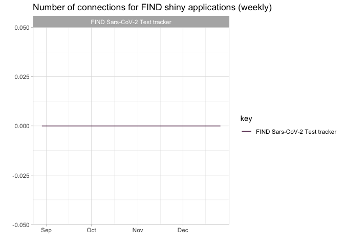

<!-- README.md is generated from README.Rmd. Please edit that file -->

# shinymetrics

<!-- badges: start -->
<!-- badges: end -->

The goal of shinymetrics is to produce metrics and accompanying plots
for the shiny application on the FIND shinyapps.io server

## Installation

You can install the development version of shinymetrics like so:

``` r
# install.packages("devtools")
devtools::install_github("finddx/shinymetrics")
#> Skipping install of 'shinymetrics' from a github remote, the SHA1 (d124c648) has not changed since last install.
#>   Use `force = TRUE` to force installation
```

## Example

This is a basic example which shows you how to retrieve number of
connections per week for the FIND Sars-CoV-2 Test tracker application,
from 01/09/2022 to 31/12/2022:

``` r
library(shinymetrics)
## basic example code
rsconnect::setAccountInfo(name='finddx',
              token=Sys.getenv("SHINYAPPS_TOKEN"),
              secret=Sys.getenv("SHINYAPPS_SECRET"))


apps <- rsconnect::applications(account = "finddx") 
app <- c("FINDCov19Tracker")
app_name <- c("FIND Sars-CoV-2 Test tracker")
server <- rep("shinyapps.io", length(app))
from <- rep("2022-09-01 0:00:00", length(app))
until <- rep("2022-12-31 0:00:00", length(app))

metrics_df <- metrics(app = app, app_name = app_name, 
                                    server = server, from = from, until = until)

unique(metrics_df$value)
#> [1] 0
p <- plot_metrics(df = metrics_df, weekly = TRUE, app_name = "FIND Sars-CoV-2 Test tracker")
print(p)
```



You’ll still need to render `README.Rmd` regularly, to keep `README.md`
up-to-date. `devtools::build_readme()` is handy for this. You could also
use GitHub Actions to re-render `README.Rmd` every time you push. An
example workflow can be found here:
<https://github.com/r-lib/actions/tree/v1/examples>.
